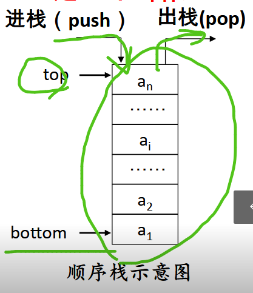
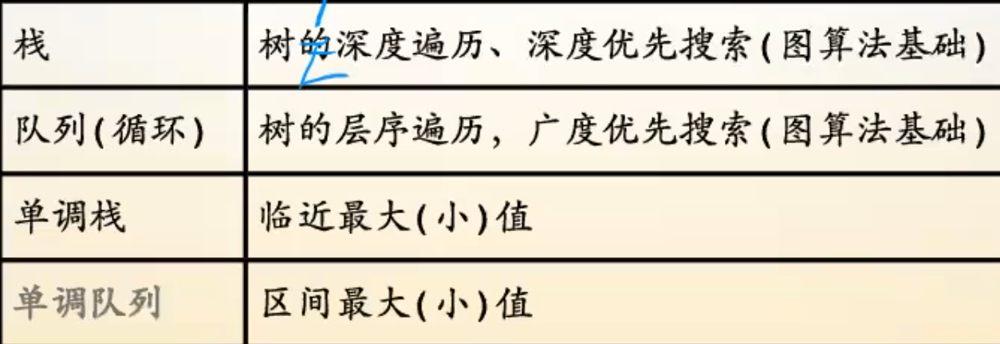

## 队列queue

队列为一种我们称为“先进先出”（First  In First Out，FIFO）的结构

## 栈Stack

一种操作受限的线性表，他可以用来处理一种完全包含关系的问题。

例题：leetcode 20括号匹配

因为栈有这种可以处理包含关系的性质，同时也有着像我们思考方式，像递归那样，不断往事情小的方向解决

特点：只能在固定一段进行插入和删除操作（后进先出

作用：完成从输入数据序列到某些输出数据序列的转换

## 栈与队列的应用

leetcode 20.232.225l;
